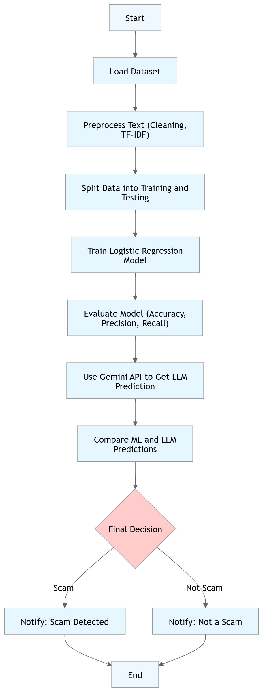
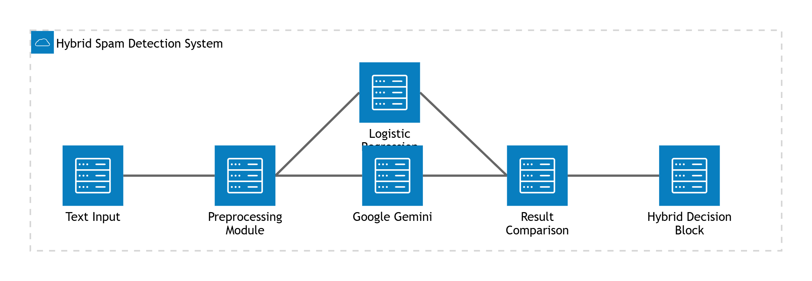
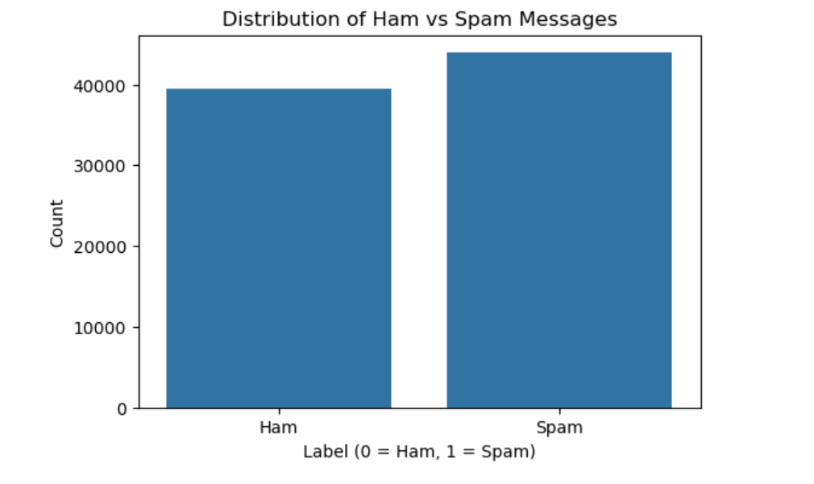
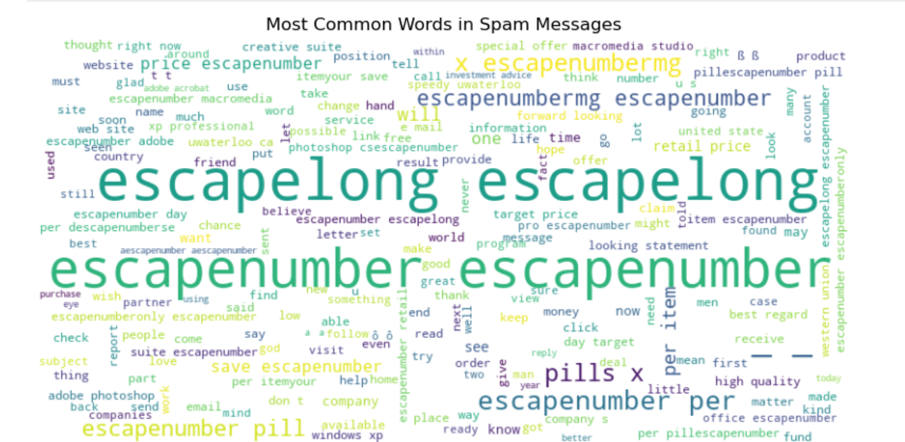
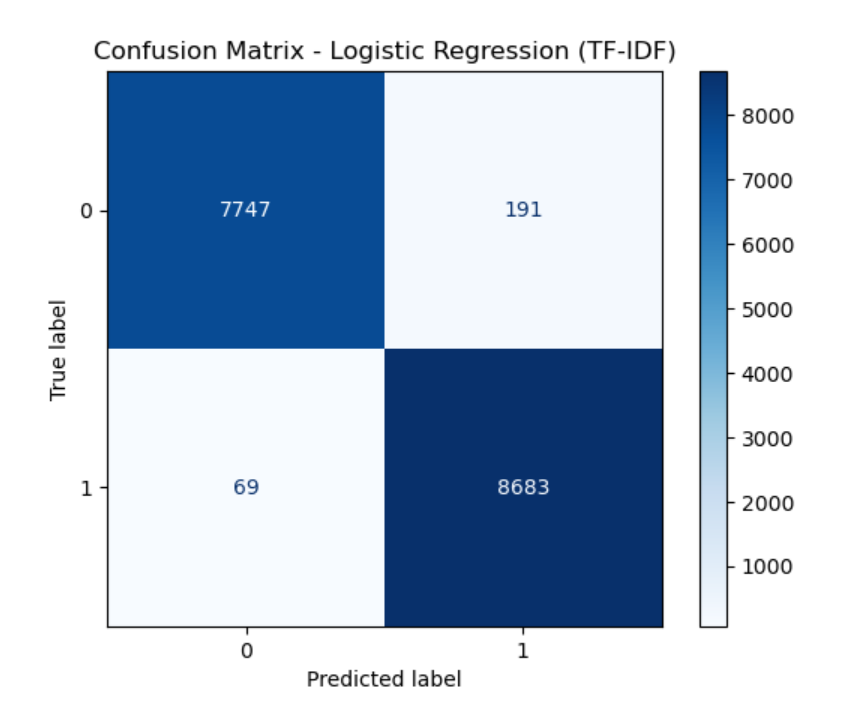
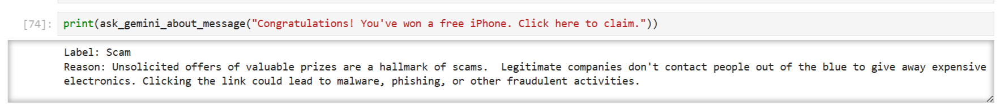
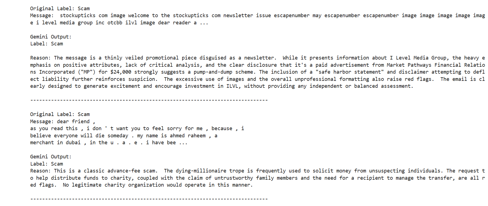
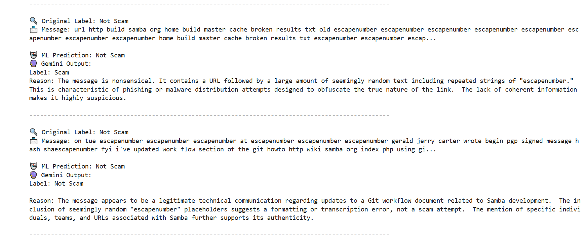
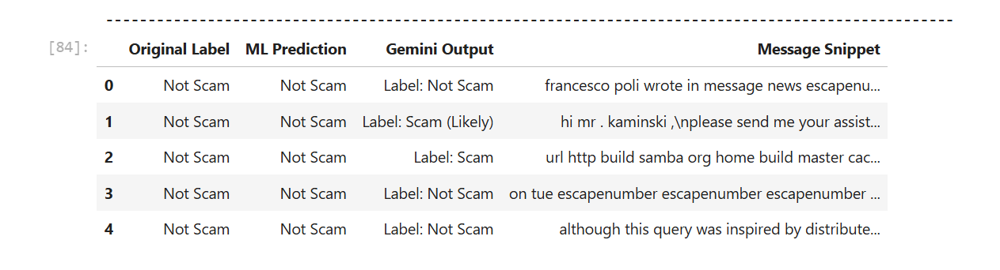

# 🚨 ScamSniffer: AI-Powered Scam Detection System

**ScamSniffer** is a hybrid scam message detection system combining the speed of Machine Learning with the intelligence of Large Language Models. Developed as part of the **Kaggle 5-Day Gen AI Workshop** and **Google Gen AI Competition**, this capstone project identifies scam messages in emails and SMS using both traditional ML techniques and Google’s **Gemini Pro**.

---

## 🎯 Objective

With digital scams becoming more deceptive, this project aims to:
- Automatically classify messages as **Scam (1)** or **Not Scam (0)**
- Compare the performance of **Logistic Regression** with **Gemini LLM**
- Build a reliable, real-world hybrid scam detection pipeline

---

## ✨ Key Features

- Preprocessing and cleaning of real-world scam dataset  
- TF-IDF vectorization + Logistic Regression training  
- Evaluation using Accuracy, Precision, Recall, F1-Score  
- **Manual rule-based detection** for spam keywords  
- **Gemini Pro** integration for LLM-based predictions  
- Visual analysis via **word clouds** and **confusion matrix**  

---

## 📊 Dataset Overview

Labeled dataset of messages/emails with binary labels:
- `1`: Scam  
- `0`: Not Scam  

**Columns:**
- `text`: Message/email content  
- `label`: Binary target label  

---

## ⚙️ Train-Test Split

- **Training Set**: 80%  
- **Test Set**: 20%

---

## 📈 Performance Metrics (Logistic Regression)

| Metric       | Non-Scam (0) | Scam (1) | Overall |
|--------------|--------------|----------|---------|
| Precision    | 0.99         | 0.98     |         |
| Recall       | 0.98         | 0.99     |         |
| F1-Score     | 0.98         | 0.98     |         |
| **Accuracy** |              |          | **98.25%** |

---

## 🧠 Project Workflow & System Design

### 1️⃣ Workflow Architecture  
Overview of the complete ML + LLM hybrid detection flow.  

### 2️⃣ System Design: ScamSniffer  
Detailed system architecture showing how the components (data, ML model, Gemini API) interact.  

---

## 🖼️ Visual Insights

### 1️⃣ Class Distribution  
Shows imbalance in ham (0) vs scam (1) messages.  

### 2️⃣ Word Cloud  
Top words in scam messages visualized.  

### 3️⃣ Confusion Matrix  
Performance of Logistic Regression model.  

### 4️⃣ Manual Scam Detection (Gemini)
Gemini LLM analyzing a manually crafted scam message:  
**"Congratulations! You've won a free iPhone. Click here to claim."**

### 5️⃣ Gemini LLM Prediction  
Gemini-based scam classification for the sample scam messages from dataset.  

### 6️⃣ ML vs Gemini Comparison  
Visual and reasoning-based comparison of predictions from the Logistic Regression model vs Gemini LLM on real-world samples. 
  

---

## 🧪 Try It Yourself

The notebook supports an **interactive detection module**:
- Enter a message and see predictions from both:
  - ✅ Logistic Regression (ML)  
  - 🤖 Gemini Pro (LLM)

Enables hands-on experimentation with hybrid scam detection.

---

## 💡 Conclusion

- The ML model is fast, interpretable, and highly accurate (98.25%)  
- Gemini excels in context-based interpretation  
- Hybrid systems (ML + LLM) offer robustness and depth  
- Easily extendable into real-time applications (e.g., SMS filter, email scanner)

---

## 🔭 Future Scope

- Fine-tune Gemini on domain-specific corpora  
- Add confidence scoring and explanation tools  
- Build a web app with Streamlit or browser extension  
- Integrate with existing spam detection pipelines  

---

## 📎 Project Links

- 📊 [Kaggle Project](https://www.kaggle.com/code/sakshimogal13/scamsniffer-ai-powered-scam-detection-system)  
- 📝 [Notion Blog](https://www.notion.so/Detecting-Scam-Messages-with-GenAI-A-Capstone-Project-1d53b02435138003a499fee172bc5ff1?source=copy_link)  

---

## 🙋‍♀️ Author

👩‍💻 **Sakshi Barku Mogal**  
🎓 Final Year Engineering Student, MVPS’s KBTCOE, Nashik  
🔗 [LinkedIn](www.linkedin.com/in/sakshi-mogal-180553280) • [GitHub](https://github.com/Sakshi-0613)

---

## ⭐ Acknowledgements

- Kaggle 5-Day Gen AI Workshop  
- Google Gen AI Platform  
- Gemini API by Google Generative AI

---
